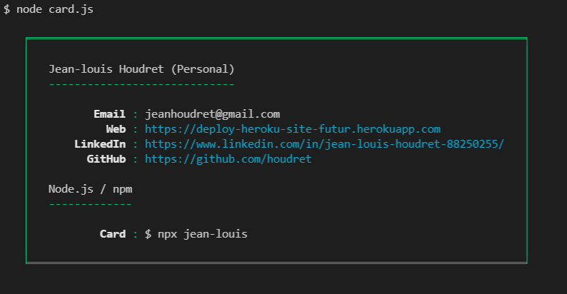

# card

Create one layout for my card personal

Inspired by @bitandbang's package https://www.npmjs.com/package/bitandbang (repo: https://github.com/bnb/bitandbang).

# Example



# API

We could have lots of functions to add a section, add a key, change something here and there however we're going simple and instead you just pass a data structure with the information you want to show.

```
const sections = [
    {
        title: 'Jean-louis Houdret (Personal)',
        details: [
            ['Email', 'jeanhoudret@gmail.com'],
            ['Web', 'https://deploy-heroku-site-futur.herokuapp.com'],
            ['LinkedIn', 'https://www.linkedin.com/in/jean-louis-houdret-88250255/'],
            ['GitHub', 'https://github.com/houdret'],
        ],
    },
    {
        title: 'Node.js / npm',
        details: [
            ['Card', '$ npx jean-louis'],
        ],
    },
]
```
Finally, once you do this, your npx command can just look like this:
```
console.log(npxcard(data));

```
# Author

```
$ npx jean-louis

```
(end)
